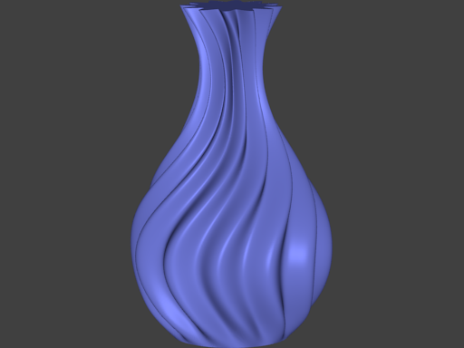
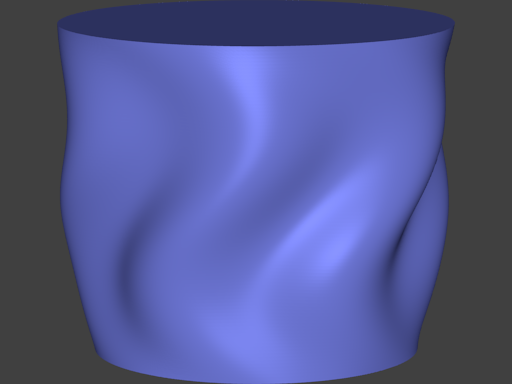

# SinVase

Python script for Blender to generate spiral vase models that can be
exported for use with 3D printers.

## Examples

A number of example shapes are provided, and are defined in the
`examples` file. Use the `generate.py` script to generate the PNG and
STL files.

The following command will read the `examples` file and put the STL
files into a directly called STL directory and put the PNGs in to a
directory called PNG.

```bash

generate.py --stl-dir stl --png-dir png examples

```
### Spiral Vase



### Tumbler



## Usage

```bash

# Run with default values
blender --python sincircle.py

# Print help
blender --python sincircle.py -- +h

usage: blender --python sincircle.py --
       [+h] [++outputstl S] [++outputpng S] [++close] [++slices I]
       [++slice-height F] [++slice-samples I] [++vase-radius F]
       [++slice-scale-wave F F F] [++slice-rotate-wave F F F]
       [++slice-wave-amplitude F] [++slice-wave-frequency I]
       [++slice-wave-magnitude-wave I I I]

Generate Blender models that are based on repeated extrusion, scaling and
rotation of a circle. All transformation heavily rely on sinusoids, and as a
result can produce a range of vase-like objects that are capable of being 3D
printed. To avoid clash with Blender, the argument prefix char is changed from
'-' to '+'.

optional arguments:
  +h, ++help            show this help message and exit
  ++outputstl S         Output stl file name. [type: str, default: none]
  ++outputpng S         Output png file name. [type: str, default: none]
  ++close               Close Blender when finished.
  ++slices I            Number of slices (or layers) generated in the model.
                        [type: int, default: 200]
  ++slice-height F      Height of each slice. [type: float, default: 0.2]
  ++slice-samples I     Number of samples taken on the edge of each slice.
                        [type: int, default: 800]
  ++vase-radius F       Base radius of each slice before scalling is applied.
                        [type: float, default: 7]
  ++slice-scale-wave F F F
                        Controls the scaling of each slice, when set to [0 0
                        1] no scaling is performed. The slice scaling is
                        calculated by a sine wave running vertically, where
                        the first and second arguments are used to linearly
                        interpolate (for each slice) a value in the domain of
                        the sine function (in degrees). The final argument
                        defines the amplitude of the sine wave. [type: float,
                        default: [0, 335, 0.6]]
  ++slice-rotate-wave F F F
                        Controls the rotation of each slice, when set to [0 0
                        1] no rotation is performed. The slice rotation is
                        calculated by a sine wave running vertically, where
                        the first and second arguments are used to linearly
                        interpolate (for each slice) a value in the domain of
                        the sine function (in degrees). The final argument
                        defines the amplitude of the sine wave. [type: float,
                        default: [0, 360, 30]]
  ++slice-wave-amplitude F
                        Each slice starts as a circle, and then has its edge
                        transformed into a sine wave. This value sets the
                        amplitude of the sine wave. To have each slice remain
                        as a circle, set this value to 0. [type: float,
                        default: 1]
  ++slice-wave-frequency I
                        Each slice starts as a circle, and then has its edge
                        transformed into a sine wave. This value sets the
                        number of resulting sine waves. Only complete waves
                        are supported, thus this value must be an integer.
                        [type: int, default: 12]
  ++slice-wave-magnitude-wave I I I
                        Controls the magnitude of the sine wave applied on
                        each slice by running a second vertical sine wave,
                        that is multiplied against the wave on the edge of
                        each slice. This can be used to create a bumpy texture
                        on the vase or chamfer the base/top. The first two
                        parameters define the start and stop of the sine wave.
                        E.g. values of [0, 180, slices] would result in a
                        round top and bottom with the ridges graduated in and
                        out. The final parameter is a cut-off (in layers), so
                        that its possible to chamfer the base of the base into
                        a circle, i.e. the default value of [0,90,20] will
                        start the base with a round circle (as the first value
                        is sin(0)=0) and over the subsequent 20 layers
                        graduate to the maximum ridges as sin(90)=1. [type:
                        float, default: [0, 90, 20]]

```

Command line arguments to the script are placed after the `--` and
instead of starting with `-` they start with `+`.
